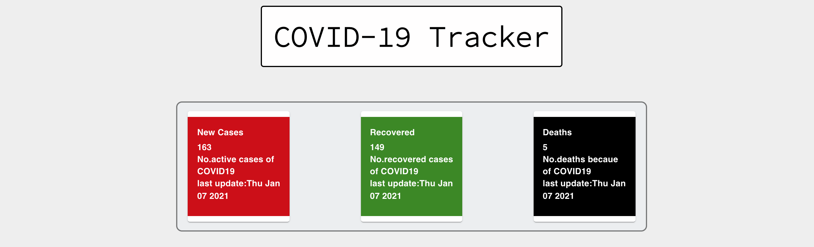
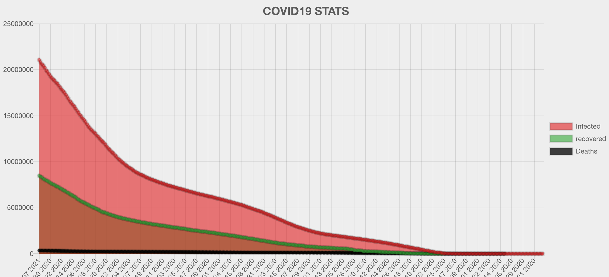
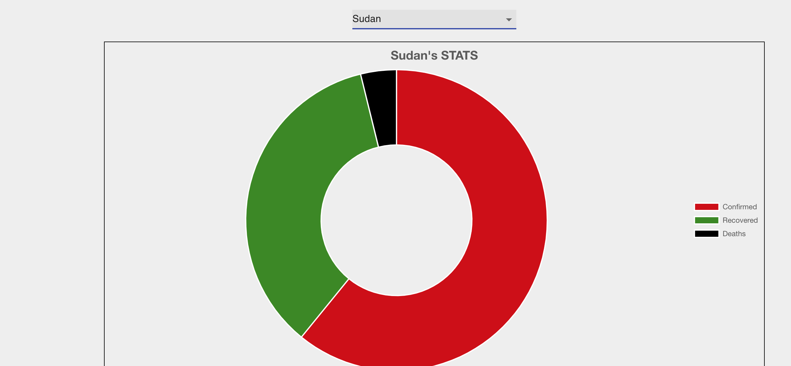

## Covid 19 Tracker

# [Live Site](https://suspicious-ptolemy-238277.netlify.app/)
- This app is a data visualization model for covid19 stats world wide and
by country.
- The app uses React to build the UI and Charts.js for data visualization and two different APIs: https://covid19.mathdro.id/api, https://api.covidtracking.com/v1/us/daily.json
for the general data and the country specific data respectively.
- To run this app locally, you can clone the repo, run npm install on the root of the project and then run npm start. pretty easy!

